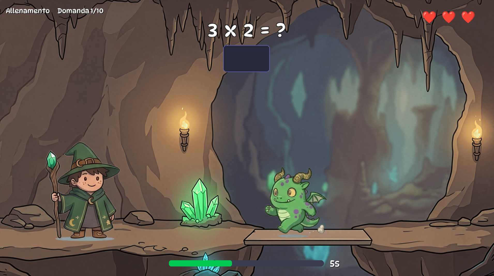

# 🧙 Math Wizard

> **Un videogioco per "allenare" le basi fondamentali della matematica... e forse non solo.**

## 📑 Indice

- [⚡ TL;DR](#-tldr)
- [📖 La Storia](#-la-storia)
- [✨ Feature e funzionalità](#-feature-e-funzionalità-e-cose-tecniche-per-chi-ne-capisce-qualcosa-in-più)
  - [🎮 Modalità di gioco](#-modalità-di-gioco)
    - [📜 Storia](#-storia)
    - [🏋️ Allenamento](#️-allenamento)
  - [🧮 Operazioni](#-operazioni)
  - [❤️ Sistema di vite e ricompense](#️-sistema-di-vite-e-ricompense)
  - [📈 Sistema di progressione](#-sistema-di-progressione)
  - [👤 Profili utente](#-profili-utente)
  - [📊 Statistiche](#-statistiche)
  - [🐞 Debug](#-debug)
  - [🛠️ Dettagli tecnici](#️-dettagli-tecnici)
  - [🚀 Come eseguire il gioco dal codice sorgente](#-come-eseguire-il-gioco-dal-codice-sorgente)

## ⚡ TL;DR


Math Wizard nasce da un'esperienza molto personale: vedere le mie due figlie affrontare con fatica le tabelline mi ha spinto a creare un videogioco che trasformasse l'apprendimento in qualcosa di divertente. Non trovando giochi che fossero davvero veloci, coinvolgenti e focalizzati sulla matematica, ho deciso di svilupparne uno io, con il loro aiuto e i loro suggerimenti. Il risultato è Math Wizard, un gioco pensato per allenare le quattro operazioni fondamentali e, in futuro, perchè no, molti altri argomenti scolastici.

---

# 📖 La Storia

Quando la mia prima figlia si è trovata davanti a uno dei primi grandi "scogli" della scuola elementare... cioè le tabelline...
Apriti cielo!

Non per mancanza di capacità cerebrali. Anzi, probabilmente proprio per l'esatto contrario. Ma mandare a memoria queste piccole ma fondamentali moltiplicazioni è stato un travaglio durato parecchi mesi, fatto di impegno, sudore e tanta pazienza. Non solo da parte della piccola, vessata dal sottoscritto e dalla nonna, ma anche da parte nostra, nel seguirla ogni giorno per essere sicuri che quella manciata di numeri entrasse (e soprattutto non uscisse più) dalla sua testa.

Fu lì che mi venne un'idea. Un'idea che, però, il tempo e le tecnologie di allora non mi permisero di realizzare.

Circa due anni dopo, scena vagamente analoga con la seconda figlia.

Ed è stato proprio in quel momento che ho deciso che forse quell'idea doveva (o almeno meritava di) diventare realtà: creare un videogioco per imparare le tabelline e allenarsi a diventare sempre più veloci.

---

## 💡 Primo presupposto

Mia moglie e io, come penso (e spero) la maggior parte dei genitori di oggi, combattiamo quotidianamente contro l'irresistibile desiderio delle nostre figlie di avere tra le mani uno smartphone, un tablet o qualsiasi altro oggetto dotato di schermo che possa essere tappato e swipato.

È una caratteristica di questa generazione. Non è una debolezza delle nostre bambine, né tantomeno degli altri bambini.

Per questo motivo non neghiamo loro qualche momento ricreativo davanti a uno schermo, ma cerchiamo ovviamente di limitarlo il più possibile, privilegiando altri tipi di svago.

E visto che, ogni tanto, questi momenti "digitali" ci sono, ho pensato: perché non fare in modo che abbiano anche un'utilità?

Così non si tratta soltanto di: *"Tieni, guardati 10 episodi di Gabby su Netflix mentre mamma e io puliamo il garage."* (Succede raramente... ma a volte succede!)

Cerchiamo invece giochi che stimolino il cervello: logica, enigmi, piccoli rompicapo... purtroppo spesso invasi dalla pubblicità. Ma comunque già meglio di quei classici idle game dove raccogli oggetti da vendere a nessuno per comprare altri oggetti altrettanto inutili.

E allora mi sono chiesto:

**Perché non creare io un videogioco, senza pubblicità, che aiuti le mie bambine a imparare, ripassare e velocizzare le tabelline?**

*"Figurati... ce ne saranno già migliaia."*

---

## 🔎 Secondo presupposto

Sì, è vero.

Di app e portali che promettono di insegnare le tabelline ce ne sono parecchi. E ammetto di non aver fatto una ricerca approfonditissima.

Però quello che ho visto è bastato a convincermi che, per ottenere quello che avevo in mente, mi conveniva rimboccarmi le maniche.

Questi sono stati i principali problemi che ho riscontrato.

### 🎮 1. Giochi "lenti"

Se un gioco deve aiutarmi a imparare le tabelline (o a migliorare), non posso passare dieci minuti a guardare l'introduzione, poi altri minuti a vedere il personaggio che cammina, parla con altri personaggi, attraversa il villaggio...

Alla fine mi propone un'operazione. Magari 2×1, nemmeno 7×9, che almeno richiederebbe un minimo di ragionamento.

Poi altri cinque minuti di animazioni.

Risultato: in mezz'ora di gioco avrò risolto sì e no dieci operazioni, senza alcuna logica nella progressione della difficoltà.

### 🎮 2. Giochi "sbagliati"

Mi è capitato un gioco in cui controllavi un personaggio che correva, saltava ostacoli e, ogni tanto, risolveva qualche operazione.

Sembrava promettente.

Peccato che l'80% del tempo fosse dedicato alla parte platform, che diventava via via sempre più difficile, assorbendo sempre più tempo e relegando la matematica in un angolino sempre più piccolo.

Un altro errore che ho identificato in questi giochi è la gestione del tempo di risposta. In quasi tutti il tempo limite per dare una risposta è assolutamente inappropriato. L'obiettivo non è creare ansia nel giocatore, ma renderlo conscio che non si può stare un'ora a pensare ad una risposta: il tempo è un bene fondamentale, e la velocità è una caratteristica da allenare.

### 🎮 3. Giochi "tristi"

Una storia, secondo me, in un videogioco è importante. Serve a creare coinvolgimento, soprattutto quando si parla di matematica, che per qualcuno potrebbe persino essere una parola da censurare.

Nei giochi "lenti", però, la storia prende completamente il sopravvento e fa perdere tempo.

Nei giochi che ne sono totalmente privi succede l'esatto contrario.

Titoli come *TuxMath* o *Math Blaster* (che cito solo per il loro valore storico) sono anche ben realizzati dal punto di vista didattico, ma difficilmente riescono ad appassionare.

Un adulto magari si diverte anche a vedere fin dove riesce ad arrivare.

Ma pretendere che due bambine si entusiasmino nel difendere una base facendo esplodere meteoriti che scendono lentissimamente verso un pinguino... beh... diciamo che l'esperimento l'ho fatto. E non è andato benissimo.

---

## 🧒 Terzo presupposto

Le mie bambine sono... molto bambine.

Non guardano film, nemmeno quelli di animazione.

Hanno visto *Gli Aristogatti*, *Cars* e pochi altri, ma non si sono mai appassionate al mondo dei cartoni come invece è successo a me con Sullivan e Mike Wazowski o con WALL·E.

Loro preferiscono giocare con i pupazzi.

Quindi avevo bisogno di un gioco tranquillo, rassicurante, in cui non si sentissero intimorite da mostri terrificanti che propongono moltiplicazioni o da robot che sparano risultati numerici.

---

## 🧑‍💻 Quarto presupposto

Sono un system administrator.

Conosco Python, lavoro quotidianamente con script, AI e IDE, e in passato mi sono occupato anche di grafica. So quindi come funzionano immagini, sprite e animazioni di base. Da qui a realizzare un videogioco comunque ce ne passa...

---

## 🚀 Come è nato Math Wizard

Mettendo insieme tutti questi ingredienti, armato di tanta buona volontà e con l'aiuto di **OpenCode**, **Big Pickle** e **Gemini**... è nato Math Wizard.

Sono partito da un semplicissimo programma Python da riga di comando che proponeva moltiplicazioni.

E l'ho fatto provare alle mie bambine.

Poi ho iniziato a studiare un sistema per aumentare gradualmente la difficoltà.

E l'ho fatto provare alle mie bambine.

Poi è arrivata la grafica.

E questa volta non gliel'ho semplicemente fatta provare. L'abbiamo costruita insieme.

Abbiamo scelto una piccola strega che lanciasse incantesimi contro un mostriciattolo che proponeva le operazioni. La scelta del mostriciattolo mi ha fatto capire quanto fosse importante il loro punto di vista, e non il mio.

Secondo il mio punto di vista, il mio mostro era simpatico, poco spaventoso. Ma per loro non era così: lo trovavano comunque troppo mostruoso. Così l'abbiamo rifatto seguendo le loro idee.

E, man mano che lo sviluppo andava avanti, non solo erano entusiaste di partecipare, ma hanno iniziato anche a proporre miglioramenti.

L'idea del **mostro finale**, più grande degli altri e da colpire più volte, è nata completamente da loro. Senza alcun suggerimento.

In pratica si sono inventate da sole il classico **boss di fine livello**, uno dei pilastri di quasi tutti i videogiochi!

A un certo punto sono emersi anche i limiti delle mie capacità grafiche, così ho chiesto aiuto a una collega molto più esperta di me, **Elena**, che mi ha dato una grandissima mano nella realizzazione di sfondi, personaggi e animazioni.

Le bambine hanno iniziato a **CHIEDERMI** di giocare (e sviluppare) Math Wizard.

E nel frattempo è successa la cosa più importante di tutte.

La mia seconda figlia, quella per cui tutto questo era nato...
...in due settimane di Math Wizard, giocando appena qualche minuto al giorno, **ha imparato le tabelline!**

A quel punto mi sono reso conto che forse le tabelline non dovevano essere l'unico obiettivo del gioco.

Così ho aggiunto addizioni e sottrazioni, permettendo anche alla mia prima figlia — che è quella che mi ha acceso la lampadina di quest'idea, ma che ormai le tabelline le conosce perfettamente — di allenarsi come la sorella, mantenendo anche una certa "parità di utilizzo" del PC.

---

## 📵 Perché non un'app per smartphone?

All'inizio pensavo di sviluppare un'app per smartphone, ma (per adesso) ho cambiato idea.

Forse Math Wizard deve rimanere un gioco per PC. Perché usare una tastiera significa anche imparare a conoscere i tasti, digitare rapidamente e prendere confidenza con il computer. A swipare e tappare, ormai, sono già bravissimi tutti.

Trasformare il gioco in un app per dispositivi mobili è particolarmente impegnativo, ed in questo momento non è la priorità.

---

## 🔮 Il futuro

Ma a parte questo lato puramente tecnico, quello che continuo a pensare è che il progetto non debba necessariamente fermarsi qui, e che le potenzialità siano enormi. Attualmente Math Wizard permette di allenarsi con le quattro operazioni fondamentali.

Ma perché non potrebbe insegnare anche a leggere l'orologio?
Oppure i verbi?
O le espressioni?
O ancora storia, geografia, inglese... magari con quiz a scelta multipla?
Le possibilità sono davvero tante.

**Vediamo cosa mi proporranno le bambine!**

---

Nel frattempo posso solo ringraziarle.

Perché, senza saperlo, mi hanno aiutato a realizzare un sogno che avevo fin da ragazzino, quando iniziavo ad appassionarmi ai computer.

**Creare un videogioco.**

---

---

# ✨ Feature e funzionalità (e cose tecniche per chi ne capisce qualcosa in più...)

## 🎮 Modalità di gioco

### 📜 Storia
La modalità principale. Il giocatore avanza attraverso livelli di una semplice ma divertente storia, affrontando un numero crescente di domande per livello. La difficoltà aumenta automaticamente: operandi più grandi, timeout più stretti (se la velocità di risposta è sufficientemente bassa). La storia si conclude con un **boss finale** da colpire più volte, e il tempo a disposizione per sconfiggerlo dipende dalla velocità media di risposta del livello appena completato.

### 🏋️ Allenamento
Modalità libera a livello singolo. Si possono scegliere tutti i parametri relativi alle domande proposte in modo da allenarsi su specifici calcoli, senza progressione. Ideale per ripassare le operazioni più difficili o per prendere confidenza con il gioco in generale.

## 🧮 Operazioni

Supporta le quattro operazioni fondamentali:

- **Addizione** (con proprietà commutativa)
- **Sottrazione** (con possibilità di permettere o vietare risultati negativi)
- **Moltiplicazione** (con proprietà commutativa)
- **Divisione** (con possibilità di permettere risultati sempre interi)

Nella modalità **Storia** ogni operazione ha una propria progressione di livelli con pool di operandi configurabili (range o liste esplicite) tramite un file json, perfetto per chi necessita di alzare o abbassare il livello generale del gioco (utile per insegnanti e genitori che vogliono "preparare" il gioco ai propri bambini).

## ❤️ Sistema di vite e ricompense

- Il giocatore parte con **3 vite** (rappresentate da cuori).
- Una risposta sbagliata toglie una vita.
- **30 risposte corrette consecutive** aggiungono una vita, con animazione del cuore che appare e sale.

## 📈 Sistema di progressione

- In modalità **Storia** ogni livello ha un numero crescente di domande: `random(8 + livello, 15 + livello)`
- Il **timeout** si riduce progressivamente: viene tagliato di 1s se la velocità media delle risposte nel livello appena giocato è inferiore alla metà del timeout impostato.
- La progressione viene salvata per-operazione nei profili utente. La storia può essere iniziata nuovamente dal principio o proseguita dal penultimo livello raggiunto.

## 👤 Profili utente

Ogni profilo salva in modo indipendente:
- Personaggio scelto
- Progresso della storia (per operazione)
- Configurazioni impostate nelle due modalità
- Statistiche e sessioni precedenti

## 📊 Statistiche

Al termine di ogni livello vengono mostrate:
- Numero di domande
- Risposte corrette
- Tempo medio di risposta

## 🐞 Debug

Un pannello di debug (attivabile digitando D E B U G), utile per sviluppo

## 🛠️ Dettagli tecnici

- Scritto in **Python** con **Pygame**
- Grafiche a **spritesheet** per giocatore, mostri
- Dialoghi della storia caricati da `data/story.json` con sostituzione dinamica di nome e genere
- Livelli e pool operandi definiti in `data/levels.json`
- **Profili salvati** in cartella `profiles/` (JSON)
- **Sessioni di gioco** salvate in `history/` (log testuali)

---

## 🚀 Come eseguire il gioco dal codice sorgente

Se hai scaricato il repository da GitHub, puoi eseguire Math Wizard sul tuo computer seguendo queste istruzioni.

### Windows

1. **Installa Python** (versione 3.8 o superiore) da [python.org](https://www.python.org/downloads/). Durante l'installazione spunta _"Add Python to PATH"_.
2. Apri **PowerShell** o il **Prompt dei comandi** e spostati nella cartella del progetto:
   ```
   cd percorso\dove\hai\scaricato\math-wizard
   ```
3. **Installa Pygame**:
   ```
   pip install pygame
   ```
4. **Avvia il gioco**:
   ```
   python math-wizard.py
   ```

### macOS

1. **Installa Python** (versione 3.8 o superiore) da [python.org](https://www.python.org/downloads/) oppure con Homebrew: `brew install python@3`
2. Apri il **Terminale** e spostati nella cartella del progetto:
   ```
   cd /percorso/dove/hai/scaricato/math-wizard
   ```
3. **Installa Pygame**:
   ```
   pip3 install pygame
   ```
4. **Avvia il gioco**:
   ```
   python3 math-wizard.py
   ```

### Linux (Debian/Ubuntu derivate)

1. **Installa Python e pip**:
   ```
   sudo apt update && sudo apt install python3 python3-pip
   ```
2. Spostati nella cartella del progetto:
   ```
   cd /percorso/dove/hai/scaricato/math-wizard
   ```
3. **Installa Pygame**:
   ```
   pip3 install pygame
   ```
4. **Avvia il gioco**:
   ```
   python3 math-wizard.py
   ```

### Note comuni

- La prima esecuzione creerà automaticamente la cartella `profiles/` con un profilo predefinito.
- Tutte le impostazioni, i progressi e le statistiche sono salvate in file JSON all'interno di `profiles/`.
- Per personalizzare i pool di operandi della modalità Storia, modifica il file `data/levels.json`.
- Per personalizzare i dialoghi della storia, modifica il file `data/story.json`.

---